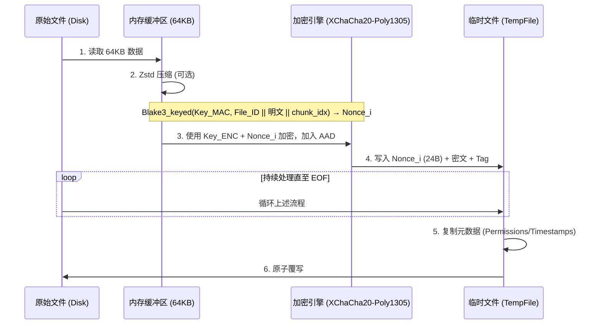

# 行为准则

你是一个资深 Rust 工程师，注重代码可维护性和性能优化，并且遵循 Rust 工程开发的最佳实践

- 少造轮子，如果有合适的第三方库就用
- 少写重复代码，多抽离出可复用的组件，并考虑向后扩展性
  - 你应该使用在编译期就能进行错误检查的设计，而不是推到运行期检查，例如多用枚举，不用硬编码。
- 单测、集成测试需要"少而精"，不要对过于简单的部分写太多单测，易错部分要多写
- 不要删除代码中运行逻辑相关的关键注释
- 使用简体中文进行交流；在代码中使用英文注释

## 项目要求

- 「单密码对称加密」这一底层逻辑不允许改变
- 所有变更都需要兼容 major version 内的之前版本
- 注意 lib API 的密钥语义**不对称**（易错点）：加密入口（`encrypt_file`/`encrypt_into` 等）接受 **Argon2 派生密钥**，解密入口（`decrypt_file`/`decrypt_into` 等）接受**原始密码**（内部用头部 salt 自行派生）。详见 `src/crypt/mod.rs` 模块文档 "Key Semantics" 一节。

## 仓库操作安全约束（不可回退的不变量）

- 加密列表是**显式允许列表**：遍历目标文件时禁止应用任何 ignore 规则（`.gitignore`/`.ignore`/全局 exclude），列表中的文件必须被加密与检查；遍历错误必须上报，不得 fail-open
- 所有文件操作必须限制在仓库根目录内：`add` 与 `encrypt`/`decrypt`/`check` 的路径参数都要拒绝 `..` 逃逸与中间符号链接逃逸（canonicalize 后双侧比较）
- 永远不得加密 `.git` 内部内容与 `git_simple_encrypt.toml` 自身（所有入口共享 `validate_repo_relative`/`validate_target_root` 校验，`.git` 按大小写不敏感比较）
- **禁止以任何形式持久化密码或其派生值**（明文、hash、加密 verifier 等一律不允许）；密码每次使用时交互输入（禁止回显）或取自 `GIT_SE_PASSWORD` 环境变量，内存中以 `Zeroizing` 包裹；git 子进程一律 `env_remove(GIT_SE_PASSWORD)`
- 密码一致性验证只能以 `HEAD` 中已提交的密文为锚点（`verify_password_against_head`，候选取自**整个** crypt list，任一成功即 Match），无锚点时静默放行；意外改密必须被拦截（交互确认或 `--allow-password-change`）
- `check --staged` 必须检查 **index 中的 blob**（`git show :<path>`），绝不用工作区文件代替
- 原子写：临时文件 fsync 后再 rename，目标目录 rename 后 best-effort fsync；事务关键路径（备份落盘、journal 写入与删除）必须用 `sync_dir_strict`，同步失败即中止
- 事务 journal 只记录 worktree 相对路径并严格解析（未知版本/截断/越界一律 fail-closed 保留）；恢复失败或 journal 损坏时 `Repo::open` 必须报错，禁止任何命令在混合状态下运行；HEAD 密码锚点验证按 distinct salt 计 Argon2 预算，超限 fail-closed（`PasswordVerificationIndeterminate`），不得返回 Mismatch/Unverifiable
- git dir 一律通过 `git rev-parse --absolute-git-dir` / `--git-common-dir` 解析（兼容 worktree/submodule），不要硬编码 `<repo>/.git`
- salt cache：只用 rkyv 安全 API（owned 反序列化，禁止 mmap/unsafe）；读写须经 fd-lock 咨询锁保护

## 加密核心算法

### 1. 密钥派生

- 程序通过 Argon2 算法结合文件的 16B Salt 派生出 32B 的 Master Key，再通过 `blake3::derive_key` 拆分为两个独立密钥，用于 XChaCha20-Poly1305 加密 + 计算每个分块的 Nonce。
  - 利用 `DashMap<Salt, Arc<OnceLock>>` 缓存已派生的密钥，减少重复 Argon2 运算。

### 2. 头部结构

每个加密文件都包含一个标准头部（64 字节）：

```text
 00          04  05  06  07           17                  27              3F
 +-----------+---+---+---+-----------+-------------------+---------------+
 |   MAGIC   | V | F | A |   SALT    |      FILE_ID      |   RESERVED    |
 |  "GITSE"  |   |   |   | (16 bytes)|    (16 bytes)     |  (24 bytes)   |
 +-----------+---+---+---+-----------+-------------------+---------------+
      |        |   |   |
      |        |   |   +--- 加密算法 (1 = XChaCha20-Poly1305)
      |        |   +------- 压缩标志位 (Bit 0: 是否 Zstd 压缩)
      |        +----------- 版本号 (当前为 4)
      +-------------------- 魔数
```

- FILE_ID：每次加密新文件时随机生成的 16 字节标识符，用于 Nonce 派生。

### 3. 加密逻辑

- 算法： 文件被切分为 64KB 的块，使用 XChaCha20-Poly1305 进行加密。
- Nonce 派生： 每个 chunk 的 nonce 基于 File_ID 和当前块自身的明文内容，通过带密钥的 Blake3 哈希计算：`Nonce_i = Blake3_keyed(Key_MAC, File_ID || M_i || chunk_idx)[0..24]`
- AAD（v4 链）： 完整的 64B HEADER + 前一块的 Poly1305 tag（16B；第 0 块以 FILE_ID 作为链种子）+ chunk_idx (8B) + is_last_chunk (1B)，共 89B。链式 AAD 使跨版本同位置重放必然坍缩为整文件回退（H-04 修复）。
- 存储格式： 每个加密分块的物理结构为 `[NONCE (24B)] [CIPHERTEXT (<= 64KB)] [Poly1305 TAG (16B)]`，Nonce 存储在分块头部。



解密：从文件读取 24 字节作为 `Nonce_i`，读取后续的密文 + Tag，直接调用 XChaCha20-Poly1305 解密。

### 4. 确定性重加密（Salt + File_ID 缓存）

为保证 decrypt -> encrypt 循环对相同文件产生完全相同的密文，程序将每个文件的 Salt 和 File_ID 持久化在每个 worktree 各自 git 目录（`git rev-parse --absolute-git-dir`，普通仓库即 `.git/`）下的 `git-simple-encrypt-salt-cache` 中。

- 加密（只读缓存）：通过 rkyv 安全 API 反序列化为 owned HashMap（无 mmap、无 unsafe）。
- 解密（写入缓存）：Rayon 线程通过 mpsc channel 发送 `(path, salt, file_id)`，主线程收集后通过 rkyv 序列化，并原子写入到磁盘，与已有缓存合并。
  - 缓存 key 使用仓库相对路径的原始字节（`/` 作为分隔符），确保跨平台一致性。
  - 只有在解密完全成功后才会写入缓存条目，失败的尝试不会污染缓存。
  - 缓存读写由 fd-lock 咨询锁保护，防止跨进程丢失条目。
