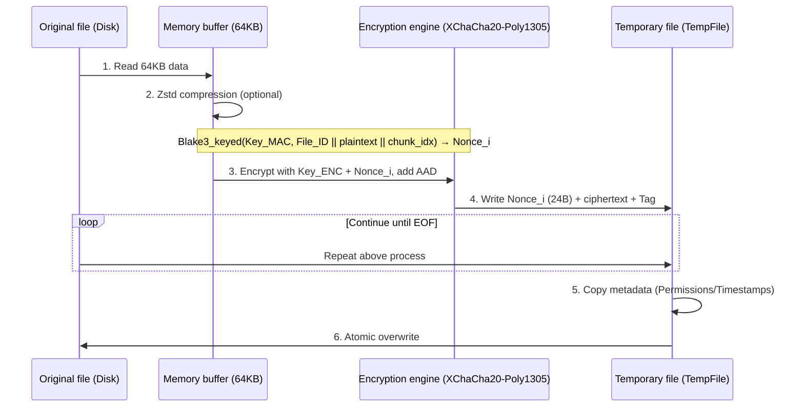

# git-simple-encrypt

English | [简体中文](./docs/README_zh-CN.md)

A secure, high-performance, easy-to-use Git encryption tool. With just one password, you can encrypt/decrypt specified files in your Git repository on any device.

- Compared to [git-crypt](https://github.com/AGWA/git-crypt), it does not require managing GPG keys or backing up key files. **Single-password symmetric encryption** is the core principle.
- Security: v2.0.0+ have been completely refactored, using **Argon2 + XChaCha20-Poly1305** to ensure security, suitable for production environments.
  - The algorithm resists bit tampering, reordering attacks, replay attacks, and truncation attacks. See [How it works](#how-it-works) for details.
- Deterministic guarantee: Salt + FILE_ID are cached during decryption and reused during encryption. If **the file has not changed, the encrypted output is also the same**, preventing repository bloat from repeated encryption/decryption. In v3.0.0+, the Nonce is derived from the current chunk plaintext + File_ID + chunk_idx, maintaining determinism while eliminating Nonce reuse risks and cross-file chunk collision issues.
- Streaming: Uses 64KB chunk encryption to reduce memory usage for large files.
- Parallel acceleration: Multi-threaded parallel encryption/decryption, fully utilizing multi-core CPU performance.
- Atomic writes: Encryption/decryption writes to a temp file, fsyncs, then atomically renames — no corruption if interrupted; preserves original file permissions and timestamps.
- Configurable Zstd compression: Enabled by default to reduce storage space.
- Explicit allowlist semantics: a file in the encryption list is always encrypted and checked — `.gitignore`/`.ignore` rules can never hide it. All operations are strictly confined to the repository root.
- Zero password persistence: the password is never stored anywhere — it is prompted on every encrypt/decrypt (no echo) or taken from `GIT_SE_PASSWORD`. A consistency check against committed encrypted files in `HEAD` prevents accidental password changes.
- Works with git worktrees and submodules: hooks are installed into the common git dir, and each worktree gets its own salt cache.

## Installation

You can choose **any** of the following methods:

- Download the file from [Releases](https://github.com/lxl66566/git-simple-encrypt/releases), extract it, and place it in any directory included in your `PATH` environment variable.
- Use [bpm](https://github.com/lxl66566/bpm):
  ```sh
  bpm i git-simple-encrypt -b git-se -q
  ```
- Use [scoop](https://scoop.sh/):
  ```sh
  scoop bucket add absx https://github.com/absxsfriends/scoop-bucket
  scoop install git-simple-encrypt
  ```
- Use [cargo-binstall](https://github.com/cargo-bins/cargo-binstall):
  ```sh
  cargo binstall git-simple-encrypt
  ```
- Build from source:
  ```sh
  cargo install git-simple-encrypt
  ```
- NixOS users can install from [my NUR](https://github.com/lxl66566/NUR).

## Usage

### Quick start

```sh
git-se add file.txt mydir   # 1. Add files/directories to the encryption list
git-se e                    # 2. Encrypt everything in the list, in place (prompts for the password)
git add . && git commit     # 3. Commit the *encrypted* files
git-se d                    # 4. Decrypt in place whenever you need plaintext
```

All commands accept `-r, --repo <PATH>` to operate on a repository other than the current directory.

### Command reference

| Command | Alias | Description |
|---|---|---|
| `git-se add <PATHS>...` | | Add files/directories to the encryption list |
| `git-se encrypt [PATHS]... [--allow-password-change]` | `e` | Encrypt in place: the whole list, or only the given paths |
| `git-se decrypt [PATHS]...` | `d` | Decrypt in place: the whole list, or only the given paths |
| `git-se pwd` | `p` | Change the master password (decrypt all, then re-encrypt) |
| `git-se check [PATHS]... [--staged]` | `c` | Exit non-zero if any target file is not encrypted |
| `git-se install` | `i` | Install the pre-commit hook (`check --staged`) |
| `git-se set <FIELD>` | | Change config: `zstd-level`, `enable-zstd` |

- **`git-se e` / `git-se d`** — Encrypt/decrypt files **in place**, prompting for the password every time (nothing is ever stored; see [Password handling](#password-handling)). Already-encrypted files are skipped on encrypt; files without a valid header are skipped on decrypt. Writes are atomic (temp file + fsync + rename) and preserve permissions and timestamps.
- **`git-se p`** — Change the master password: decrypts every listed file with the old password, then re-encrypts everything with the new one (entered twice). This is the only supported way to change passwords — it never leaves the repository in a mixed state.
- **`git-se add <PATHS>...`** — Adds entries to `crypt_list` in `git_simple_encrypt.toml`. Directories are taken recursively — every file inside gets encrypted. Paths are interpreted relative to the repository root. Paths escaping the repo (`../...`), anything inside `.git`, and the config file itself are **rejected**; duplicates are ignored. To *remove* an entry, edit `git_simple_encrypt.toml` by hand.
- **`git-se c`** — Checks encryption status and exits non-zero when any target file is unencrypted, so it is usable in CI. With `--staged`, only files staged for commit are checked (this is what the pre-commit hook runs); non-ASCII and otherwise unusual filenames are handled correctly. Needs no password.
- **`git-se i`** — Writes a `pre-commit` hook into the *common* git dir (so it also covers linked worktrees) that runs `git-se check --staged` and blocks the commit if a listed file would be committed in plaintext. Fails if a hook already exists.
- **`git-se set`** — Non-interactive configuration:
  - `git-se set zstd-level <1-22>` — compression level (default: 15)
  - `git-se set enable-zstd <true|false>` — toggle compression (default: true)

### What exactly gets encrypted

The encryption list is an **explicit allowlist**:

- `.gitignore`, `.ignore`, and global git excludes **never** hide listed files — if you listed it, it gets encrypted and checked. (This is deliberate: silently skipping a listed file could trick you into committing plaintext.)
- Hidden files are included; symbolic links are not followed.
- `.git` and the `git_simple_encrypt.toml` config file itself are always excluded.
- Every operation is confined to the repository root — files outside it are never read or written.

The configuration file looks like this:

```toml
use_zstd = true
zstd_level = 15
crypt_list = ["secrets/", "config.prod.json"]
```

### Password handling

- **Nothing is ever stored.** The password lives only in memory for the duration of one command, wrapped in `Zeroizing`. Every `git-se e` / `git-se d` prompts for it (input is not echoed). For scripts, set the `GIT_SE_PASSWORD` environment variable or pipe the password via stdin (`echo "$PW" | git-se e`).
- **Typo protection.** When a password is *established* (first encryption — nothing to verify against), it is asked for twice. Afterwards, `git-se e` verifies the entered password against an encrypted version of a listed file committed in `HEAD` — the same baseline `git diff` compares against, so it stays in sync across machines automatically with zero stored state.
- **Accidental password changes are caught.** If the entered password does not match the one used for committed encrypted files, you can re-enter / use the new password anyway / abort. Non-interactively (pipe/CI) it is an error; pass `--allow-password-change` for an intentional change. When nothing verifiable exists in `HEAD`, the check is skipped silently (there is no history to bloat yet).
- **Wrong password on decrypt** is detected up front by a first-chunk pre-check, before any file is written.
- **Changing the password:** `git-se p` decrypts everything with the old password and re-encrypts with the new one — the repo never ends up in a mixed state.
- **Migration:** a password stored in `.git/config` by an older version is removed automatically (with a notice) the first time a new `git-se` opens the repository.

### git worktrees & submodules

Both are supported. The pre-commit hook is installed into the *common* git dir so it fires for every linked worktree, while the salt cache lives in the *per-worktree* git dir (`git rev-parse --absolute-git-dir`), keeping deterministic re-encryption independent per worktree.

## Important Notes

- Configuration file: The encryption list and configuration are stored in `git_simple_encrypt.toml`. To remove a file from the list, edit this file manually.
- Migration notice:
  - Encryption/decryption algorithms are incompatible across major versions. First decrypt all files in the repository. For v1.x -> v2.x, also remove all wildcard entries from the `git_simple_encrypt.toml` list (v2.x+ does not support wildcards), then upgrade the version.

---

## How it works

The encryption process for v3.0.0+ is as follows:

### 1. Key Derivation

- The program uses the Argon2 algorithm combined with a 16-byte file Salt to derive a 32-byte Master Key, then splits it into two independent keys via `blake3::derive_key`. These keys are used for XChaCha20-Poly1305 encryption and for deriving the Nonce for each chunk.
- Derived keys are cached using `DashMap<Salt, Arc<OnceLock>>` to reduce repeated Argon2 computations.

### 2. Header Structure

Each encrypted file contains a standard header (64 bytes):

```text
 00          04  05  06  07           17                  27              3F
 +-----------+---+---+---+-----------+-------------------+---------------+
 |   MAGIC   | V | F | A |   SALT    |      FILE_ID      |   RESERVED    |
 |  "GITSE"  |   |   |   | (16 bytes)|    (16 bytes)     |  (24 bytes)   |
 +-----------+---+---+---+-----------+-------------------+---------------+
      |        |   |   |
      |        |   |   +--- Encryption algorithm (1 = XChaCha20-Poly1305)
      |        |   +------- Compression flag (Bit 0: Zstd compression enabled)
      |        +----------- Version number (currently 3)
      +-------------------- Magic number
```

- FILE_ID: A 16-byte random identifier generated each time a new file is encrypted, used for Nonce derivation.

### 3. Encryption Logic

- Algorithm: Files are split into 64KB chunks and encrypted using XChaCha20-Poly1305.
- Nonce derivation: The nonce for each chunk is derived from the File_ID and the plaintext of the current chunk using keyed Blake3 hashing: `Nonce_i = Blake3_keyed(Key_MAC, File_ID || M_i || chunk_idx)[0..24]`
- AAD: Includes the full 64-byte HEADER + chunk_idx (8 bytes) + is_last_chunk (1 byte), totaling 73 bytes. The HEADER is bound as AAD for all chunks.
- Storage format: The physical structure of each encrypted chunk is `[NONCE (24B)] [CIPHERTEXT (<= 64KB)] [Poly1305 TAG (16B)]`, with the Nonce stored at the chunk header.



Decryption: Read 24 bytes from the file as `Nonce_i`, then read the subsequent ciphertext + Tag, and directly call XChaCha20-Poly1305 decryption.

### 4. Deterministic Re-encryption (Salt + File_ID Caching)

To ensure that a decrypt -> encrypt cycle produces exactly the same ciphertext for the same file, the program persists the Salt and File_ID for each file in `git-simple-encrypt-salt-cache` inside the per-worktree git dir (`git rev-parse --absolute-git-dir`; that is `.git/` for a normal repository, so linked worktrees and submodules each get their own cache).

- Encryption (read-only cache): The cache file is mapped to memory via mmap, and rkyv zero-copy deserialization allows direct lookups.
- Decryption (write cache): Rayon threads send `(path, salt, file_id)` through an mpsc channel; the main thread collects them, serializes via rkyv, and atomically writes to disk, merging with the existing cache.
  - The cache key uses the raw bytes of the repository-relative path (with `/` as the separator), ensuring cross-platform consistency.
  - Entries are recorded only after a fully successful decryption, so failed attempts (wrong password, corrupted data) never poison the cache.
