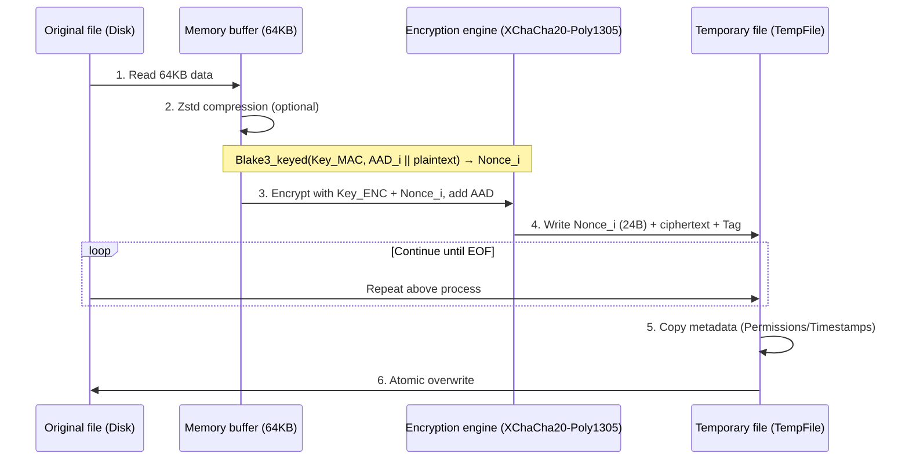

# git-simple-encrypt

English | [简体中文](./docs/README_zh-CN.md)

A secure, high-performance, easy-to-use Git encryption tool. With just one password, you can encrypt/decrypt specified files in your Git repository on any device.

- Compared to [git-crypt](https://github.com/AGWA/git-crypt), it does not require managing GPG keys or backing up key files. **Single-password symmetric encryption** is the core principle.
- Security: v2.0.0+ have been completely refactored, using **Argon2 + XChaCha20-Poly1305** to ensure security, suitable for production environments.
  - The algorithm resists bit tampering, chunk reordering, and truncation. v4.0.0 adds a per-chunk AAD chain, so ciphertext blocks from an older version of a file cannot be spliced into a newer one. Note the precise scope: this defeats *partial* cross-version replay, not a **whole-file rollback** — replacing a file with a complete, previously valid ciphertext of itself cannot be detected without state kept outside the file, and git history is where that belongs. See [How it works](#how-it-works) for details.
- Deterministic guarantee: Salt + FILE_ID are cached during decryption and reused during encryption. If **the file has not changed, the encrypted output is also the same**, preventing repository bloat from repeated encryption/decryption. The Nonce is derived from the chunk's **entire AEAD input** (its AAD — header, chain link, chunk index, last-chunk flag — plus the chunk plaintext), maintaining determinism while guaranteeing that — except with the negligible probability of a PRF collision — a repeated Nonce can only ever authenticate a byte-identical input.
- Streaming: Uses 64KB chunk encryption to reduce memory usage for large files.
- Parallel acceleration: Multi-threaded parallel encryption/decryption, fully utilizing multi-core CPU performance.
- Atomic writes: Encryption/decryption writes to a temp file, fsyncs, then atomically renames — no corruption if interrupted; preserves original file permissions and timestamps (best effort). Repo-wide operations go further and only start replacing files once *every* file has been prepared successfully, so a failure cannot leave a half-converted repository ([Atomicity](#atomicity)).
- Configurable Zstd compression: Enabled by default to reduce storage space.
- Explicit allowlist semantics: a file in the encryption list is always encrypted and checked — `.gitignore`/`.ignore` rules can never hide it. Operations are confined to the repository root (`..`, symlinked components and git internals are all rejected); see [Threat model](#threat-model) for the exact guarantee.
- Zero password persistence: the password is never stored anywhere — it is prompted on every encrypt/decrypt (no echo) or taken from `GIT_SE_PASSWORD`. A consistency check against committed encrypted files in `HEAD` prevents accidental password changes.
- Works with git worktrees and submodules: hooks are installed into the common git dir, and each worktree gets its own salt cache.

## Installation

You can choose **any** of the following methods:

- Download the file from [Releases](https://github.com/lxl66566/git-simple-encrypt/releases), extract it, and place it in any directory included in your `PATH` environment variable.
- Use [bpm](https://github.com/lxl66566/bpm):
  ```sh
  bpm i git-simple-encrypt -b git-se -q
  ```
- Use [scoop](https://scoop.sh/):
  ```sh
  scoop bucket add absx https://github.com/absxsfriends/scoop-bucket
  scoop install git-simple-encrypt
  ```
- Use [cargo-binstall](https://github.com/cargo-bins/cargo-binstall):
  ```sh
  cargo binstall git-simple-encrypt
  ```
- Build from source:
  ```sh
  cargo install git-simple-encrypt
  ```
- NixOS users can install from [my NUR](https://github.com/lxl66566/NUR).

## Usage

### Quick start

```sh
git-se add file.txt mydir   # 1. Add files/directories to the encryption list
git-se e                    # 2. Encrypt everything in the list, in place (prompts for the password)
git add . && git commit     # 3. Commit the *encrypted* files
git-se d                    # 4. Decrypt in place whenever you need plaintext
```

All commands accept `-r, --repo <PATH>` to operate on a repository other than the current directory.

### Command reference

| Command | Alias | Description |
|---|---|---|
| `git-se add <PATHS>...` | | Add files/directories to the encryption list |
| `git-se encrypt [PATHS]... [--allow-password-change]` | `e` | Encrypt in place: the whole list, or only the given paths |
| `git-se decrypt [PATHS]...` | `d` | Decrypt in place: the whole list, or only the given paths |
| `git-se pwd` | `p` | Change the master password (decrypt all, then re-encrypt) |
| `git-se check [PATHS]... [--staged]` | `c` | Exit non-zero if any target file is not encrypted |
| `git-se install` | `i` | Install the pre-commit hook (`check --staged`) |
| `git-se set <FIELD>` | | Change config: `zstd-level`, `enable-zstd` |

- **`git-se e` / `git-se d`** — Encrypt/decrypt files **in place**, prompting for the password every time (nothing is ever stored; see [Password handling](#password-handling)). On encrypt, a file that is already encrypted is skipped — but only after being **fully decrypted** (to nowhere) against the password you gave, so one encrypted with a *different* password, a forged header, or plaintext appended to the ciphertext is reported rather than passed over. On decrypt, files without a valid header are skipped. Writes are atomic (temp file + fsync + rename) and preserve permissions and timestamps (best effort).
- **`git-se p`** — Change the master password (entered twice). This is the only supported way to change passwords. It runs as a **single transaction**: every file is re-encrypted old-password → new-password into a temp file first, and the originals are replaced only once all of them have succeeded; a failure during the replacement rolls the earlier files back. A listed file that is currently *plaintext* is encrypted with the new password rather than skipped, so the command cannot report success while leaving listed plaintext behind — and when the list is *entirely* plaintext, no old password is asked for (there is nothing to decrypt); the command simply establishes the new password on those files. The plaintext of already-encrypted files only ever exists in temp files, never at the destination — but see the crash caveat under [Atomicity](#atomicity).
- **`git-se add <PATHS>...`** — Adds entries to `crypt_list` in `git_simple_encrypt.toml`. Directories are taken recursively — every file inside gets encrypted. Paths are interpreted relative to the repository root. Paths escaping the repo (`../...`), anything inside `.git`, and the config file itself are **rejected**; duplicates are ignored. To *remove* an entry, edit `git_simple_encrypt.toml` by hand. (Hand-edited entries must be plain repo-relative paths too — an entry containing `..` or an absolute path is a hard error in every mode, never silently ignored.)
- **`git-se c`** — Checks encryption status and exits non-zero when any target file is unencrypted, so it is usable in CI. With `--staged`, the check reads every covered blob from the **index** — not just what changed — so widening the crypt list cannot leave already-committed plaintext unchecked. The policy is the *union* of the staged config and the working-tree config: `crypt_list` is an allowlist, so a union can only ever demand *more* encryption (the fail-closed direction), and it keeps a file covered while its newly-added config entry is not yet staged. Needs no password, and therefore verifies format rather than authenticity ([Threat model](#threat-model)). Filenames with non-ASCII bytes, spaces or newlines are handled correctly.
- **`git-se i`** — Writes a `pre-commit` hook into the directory git actually resolves hooks from (`git rev-parse --git-path hooks`: the *common* git dir, so it also covers linked worktrees, unless `core.hooksPath` redirects hooks elsewhere — which is honored) that runs `git-se check --staged` and blocks the commit if a listed file would be committed in plaintext. Fails if a hook already exists.
- **`git-se set`** — Non-interactive configuration:
  - `git-se set zstd-level <1-22>` — compression level (default: 15)
  - `git-se set enable-zstd <true|false>` — toggle compression (default: true)

### What exactly gets encrypted

The encryption list is an **explicit allowlist**:

- `.gitignore`, `.ignore`, and global git excludes **never** hide listed files — if you listed it, it gets encrypted and checked. (This is deliberate: silently skipping a listed file could trick you into committing plaintext.)
- Hidden files are included; symbolic links are not followed.
- Any `.git` directory — including a nested repository's — and the `git_simple_encrypt.toml` config file itself are always excluded.
- Every operation is confined to the repository root: `..`, symlinked path components and paths resolving outside the root are all rejected, and the config file is checked the same way — a symlinked config, or one resolving into a git dir, is refused outright. See [Threat model](#threat-model) for the one case this does not cover.

The configuration file looks like this:

```toml
use_zstd = true
zstd_level = 15
crypt_list = ["secrets/", "config.prod.json"]
```

### Password handling

- **Nothing is ever stored.** The password lives only in memory for the duration of one command, wrapped in `Zeroizing`. Every `git-se e` / `git-se d` prompts for it (input is not echoed). For scripts, set the `GIT_SE_PASSWORD` environment variable or pipe the password via stdin (`echo "$PW" | git-se e`). Note the env var is **weaker** than interactive entry: it is visible in the process environment (e.g. `/proc/<pid>/environ` to the same user) — git-se scrubs it from every git subprocess it spawns, but it cannot scrub your shell. Prefer interactive entry when possible.
- **Typo protection.** When a password is *established* (first encryption — nothing to verify against) and it was entered interactively on a terminal, it is asked for twice. The confirmation is skipped when the password comes from `GIT_SE_PASSWORD` or a non-terminal stdin (there is nobody to confirm to). Afterwards, `git-se e` verifies the entered password against an encrypted version of a listed file committed in `HEAD` — the same baseline `git diff` compares against, so it stays in sync across machines automatically with zero stored state.
- **Accidental password changes are caught.** If the entered password does not match the one used for committed encrypted files, you can re-enter / use the new password anyway / abort. Non-interactively (pipe/CI) it is an error; pass `--allow-password-change` for an intentional change. When nothing verifiable exists in `HEAD`, the check is skipped silently (there is no history to bloat yet). `--allow-password-change` only ever skips this *password* check — it never relaxes repository-boundary verification or the per-file authentication of already-encrypted targets, and git-se refuses to operate at all without a working `git` binary (the boundary checks are answered by git plumbing). With the flag set, **every encrypted file in the whole crypt list is authenticated against the given password**, so it cannot leave the repository in a mixed-password state that `git-se p` could not repair — if any file still answers to another password, the command refuses and points you at `git-se p`.
- **Wrong password on decrypt** is detected up front by a first-chunk pre-check, before any file is written.
- **Changing the password:** `git-se p` re-encrypts every listed file in one transaction, so the repo never ends up with some files on the old password and some on the new one. See [Atomicity](#atomicity) for the exact guarantee.
- **Migration:** a password stored in `.git/config` by an older version is removed automatically (with a notice) the first time a new `git-se` opens the repository.

### git worktrees & submodules

Both are supported. The pre-commit hook is installed into the *common* git dir so it fires for every linked worktree, while the salt cache lives in the *per-worktree* git dir (`git rev-parse --absolute-git-dir`), keeping deterministic re-encryption independent per worktree.

### Atomicity

`git-se e`, `git-se d` and `git-se p` run in two phases:

1. **Prepare** — every file is transformed into a temp file next to its target and fsynced. Nothing visible changes.
2. **Commit** — each destination is backed up, then the temp file is renamed over it.

If *any* file fails during phase 1, the whole command aborts and **not one file is modified**; the temp files are discarded. If a file fails during phase 2, every file already replaced is **rolled back** from its backup, so the repository again ends up unchanged. That is what rules out a half-converted repository — for example one file left encrypted while the next has already been written back as plaintext, or a password change that leaves half the files on the old password and half on the new one.

The intended replacements are journaled inside the git dir before phase 2 starts (paths recorded relative to the worktree, so a moved repository still recovers). If the process is killed mid-commit, the next `git-se` command restores the originals from that journal and tells you to re-run. The journal is the commit point: it is removed only after every replacement succeeded, and *before* the backups are — so while a journal exists, every backup it references is guaranteed to exist too. A partial recovery rewrites the journal to only what is still unrestored, and if anything *cannot* be restored automatically — or the journal itself is unreadable — **every** `git-se` command refuses to run until you restore the listed backups manually and remove the journal: no command ever proceeds from a half-recovered tree.

Only one `git-se` process may operate on a repository at a time: the process holds an advisory lock (`<git-dir>/git-se.lock`) for the whole command, and a second `git-se` fails fast instead of "recovering" the first one's live transaction or deleting its files mid-commit. The lock is released as soon as the command finishes (for library users: when the last `Repo` handle drops).

Limits worth knowing:

- Phase 1 needs temporary space roughly equal to the total size of the target files, and phase 2 briefly needs room for a backup of each (a hard link where the filesystem supports it, otherwise an atomic copy).
- Rollback is best-effort: if restoring a backup *also* fails (a directory that became read-only, a full disk), the error names every file involved and its backup, which is left in place as `.git-se-bak.*` — together with the journal, so no later command can silently discard that recovery material.
- **Backups, the journal, and every replaced destination are fsynced on the transaction's critical path, and a sync failure aborts the transaction — on Unix.** Restores copy the backup over the destination (atomically) without consuming it, so a crash mid-recovery simply redoes idempotent work on the next run. That is what makes the crash guarantees above survive a power cut there. On macOS the directory sync uses `fcntl(F_FULLFSYNC)` (plain `fsync` does not flush the drive cache there), so the power-loss guarantee holds too. Windows has no portable directory fsync: there the guarantee degrades to *process-crash* recovery (SIGKILL, panic), not power-loss durability.
- **A crash can leave a plaintext temp file behind.** `SIGKILL`, a power cut or an OOM kill run no destructors, and an interrupted *decrypt* has plaintext in its temp file. These are named `.git-se-tmp.` + 16 random characters, added to `<git-dir>/info/exclude` so `git add` cannot collect them (a failure to read or write that file is reported loudly, never silently), and swept once they are at least an hour old. Between the crash and that sweep, the plaintext is on disk. There is no way to prevent this entirely; if it matters, treat an interrupted decrypt as a disclosure of that file.
- **An *encrypt* backup is plaintext too — and so is a password change's, for files that were plaintext.** Phase 2 backs up each destination before replacing it — and before an encrypt (or for the plaintext members of a `git-se p` run), the destination is the plaintext. The backups are removed as soon as the commit finishes; only a crash in that window (or a removal failure, which the command then reports with every affected path instead of silently succeeding) can leave one behind. Like temp files they are named recognizably, excluded from git, and swept when old enough.
- **Backup metadata has limits.** Where hard links are unavailable, a backup is a copy that makes a *best effort* to preserve permissions and timestamps — a metadata-copy failure is logged, not fatal, so they are not guaranteed. Ownership, ACLs, xattrs, and other platform-specific attributes are never copied. A rollback after such a copy restores the contents, and permissions and timestamps at best effort.
- **The sweep's name shapes are reserved names, not proof of ownership.** It deletes files named `.git-se-tmp.` + exactly 16 alphanumeric characters or `.git-se-bak.<32 lowercase-or-uppercase hex digits>.<digits>` once they are an hour old. A file of yours that happens to carry exactly such a name is indistinguishable from git-se's own leftovers and *will* be collected — treat these shapes as reserved and do not use them for your own files. Shapes git-se has never generated (`.git-se-tmp.ABC123`, `.git-se-bak.2024`, `.git-se-bak.data`) never match and are left in place.

### Threat model

git-se protects the *contents* of listed files against anyone who can read the repository — a git host, a backup, a stolen laptop. Within those bounds:

- **Confinement to the repository** holds as long as no other process is concurrently rearranging the repository's directory structure. Paths are validated (no `..`, no symlinked component, canonical form inside the root) and re-checked before use, but validation and the subsequent `open`/`rename` are separate syscalls. A local attacker who can write to a directory *inside* your repository can, in principle, win that race and redirect a read or write outside it. Closing this completely needs capability-based APIs (`openat2` with `RESOLVE_BENEATH`), which exist only on Linux; git-se runs on macOS and Windows too, so it is not implemented. **Do not run git-se on a repository whose directories are writable by users you do not trust.**
- **`git-se c` is an accident guard, not authentication.** It runs without a password, so it can only check that a file *looks* encrypted: magic, version, flags, and plausible chunk framing. A deliberately crafted file — a valid header with plaintext appended, say — passes. It reliably catches the thing it exists for: forgetting to run `git-se e`. Anything stronger requires the password, which `git-se e` does use (see below).
- **`git-se e` authenticates before skipping.** A file that is already encrypted is fully decrypted (to nowhere) against the password you supplied — every chunk, not just the first — so a file encrypted under a *different* password, a forged header, or a ciphertext with plaintext appended is reported instead of silently passed over.
- **HEAD password verification has an Argon2 budget.** Verifying your password against the committed anchors costs one Argon2 derivation per *distinct salt* among them, and a hostile repository can commit many small forged anchors — no password needed — to multiply that cost. Verification therefore stops after 8 distinct salts and fails *indeterminate* (neither accepting nor rejecting the password) rather than burning unbounded CPU. Legitimate histories stay far below this: anchors share the batch salt of the run that encrypted them, so distinct salts ≈ distinct encryption batches, and a correct password matches at the first genuine anchor anyway. A history that legitimately exceeds the default can raise the budget explicitly via `GIT_SE_HEAD_ANCHOR_BUDGET`. Note the budget bounds the attack, it does not eliminate it: a hostile repository can still force up to that many derivations — a few seconds of fixed delay — before every `git-se e` on it fails indeterminate. If you regularly work with untrusted clones, that delay is the price of verifying anything at all; the alternative (`--allow-password-change`) skips verification entirely.
- **Working-tree operations have an Argon2 budget too.** The same forged-file trick works against encrypt/decrypt targets: a hostile clone can carry any number of small forged encrypted files, and every *distinct salt* among them costs one derivation before the file can be rejected. Operations therefore scan the target headers first and refuse — before any per-target derivation runs — when the targets carry more than 64 distinct salts; a repository that legitimately has that many encryption batches can raise the budget explicitly via `GIT_SE_SALT_BUDGET`. Independent of the totals, concurrent Argon2 derivations are also capped (at most 4 in flight), bounding the transient memory spike on many-core machines. (Salts taken from the local salt cache are not budgeted: that cache lives in the git dir, which a cloned repository cannot ship.)
- **The actual git directory is untouchable, whatever its name.** A `git init --separate-git-dir=<dir>` layout can place the real git dir inside the worktree under an arbitrary name. git-se resolves the git dirs through git plumbing and treats them exactly like `.git`: `add` and explicit targets pointing inside are rejected, recursive walks prune them, the staged check never demands them encrypted, transaction recovery refuses to restore into them, and the temp-file sweep never enters them. The same applies to **nested** repositories: when a repository is opened, git-se scans the worktree for nested git dirs — `.git` directories, `.git` *pointer files* (`gitdir: ...`, read with a size cap; the target is canonicalized and proven to lie inside the worktree *before* any of its bytes are read, and honored only when it really is a git dir, so a forged pointer can hide nothing), and nested **bare** repositories (recognized by their strict `HEAD` + `objects/` + `refs/` structure **plus** the `[core]` `bare`/`worktree` evidence every git-created git dir carries in its `config`; both files are read with size caps). **Shape alone is never the verdict**: git tracks `HEAD`/`objects/`/`refs/`-shaped contents as ordinary files without complaint, so a candidate that lacks the config evidence — or beneath which the repository itself tracks files — fails the open with an ambiguity error telling you how to disambiguate. Silently protecting such a directory could hide tracked plaintext from the crypt list (and from `check --staged`); silently encrypting it could shred a repository. Everything confirmed joins the protected set shared by `add`, explicit targets, walks, the staged check, HEAD anchors, recovery and the sweep; a nested worktree's ordinary files stay in scope. The scan is fail-closed and covers the whole worktree on every open — a nested git dir can sit anywhere, and an unreadable directory cannot be skipped safely (its files could still be replaced by path), so an unreadable pointer, directory or `HEAD` blocks every command until the cause is fixed.
- **Ciphertext rollback is not prevented.** See the note on replay above; git history is the defence.
- **The password is only as safe as the process.** See [Password handling](#password-handling); the `GIT_SE_PASSWORD` environment variable in particular is visible to anything that can read the process environment.

## Important Notes

- Configuration file: The encryption list and configuration are stored in `git_simple_encrypt.toml`. To remove a file from the list, edit this file manually.
- Migration notice:
  - Encryption/decryption algorithms are incompatible across major versions. First decrypt all files in the repository. For v1.x -> v2.x, also remove all wildcard entries from the `git_simple_encrypt.toml` list (v2.x+ does not support wildcards), then upgrade the version.
  - **v3.x -> v4.x**: decrypt all files with v3 (`git-se d`), then upgrade. v4.x reads only format-version-5 files (per-chunk AAD chain + nonce bound to the full AEAD input). v4.x also stops persisting anything password-related: a password stored in `.git/config` by an older version is removed automatically on first run.
  - **Pre-release v4 development builds**: they wrote format version 4 (plaintext-only nonce derivation), which is deliberately NOT readable — it was never published. If you used such a dev build, decrypt with it first, then re-encrypt with the release.

---

## How it works

The encryption process for v4.0.0+ is as follows:

### 1. Key Derivation

- The program uses the Argon2 algorithm combined with a 16-byte file Salt to derive a 32-byte Master Key, then splits it into two independent keys via `blake3::derive_key`. These keys are used for XChaCha20-Poly1305 encryption and for deriving the Nonce for each chunk.
- Derived keys are cached using `DashMap<Salt, Arc<OnceLock>>` to reduce repeated Argon2 computations.

### 2. Header Structure

Each encrypted file contains a standard header (64 bytes):

```text
 00          04  05  06  07           17                  27              3F
 +-----------+---+---+---+-----------+-------------------+---------------+
 |   MAGIC   | V | F | A |   SALT    |      FILE_ID      |   RESERVED    |
 |  "GITSE"  |   |   |   | (16 bytes)|    (16 bytes)     |  (24 bytes)   |
 +-----------+---+---+---+-----------+-------------------+---------------+
      |        |   |   |
      |        |   |   +--- Encryption algorithm (1 = XChaCha20-Poly1305)
      |        |   +------- Compression flag (Bit 0: Zstd compression enabled)
      |        +----------- Version number (currently 5)
      +-------------------- Magic number
```

- FILE_ID: A 16-byte random identifier generated each time a new file is encrypted, used for Nonce derivation.

### 3. Encryption Logic

- Algorithm: Files are split into 64KB chunks and encrypted using XChaCha20-Poly1305.
- Nonce derivation: The nonce for each chunk is derived from the chunk's **entire AEAD input** — the fully assembled AAD plus the current chunk's plaintext — using keyed Blake3 hashing: `Nonce_i = Blake3_keyed(Key_MAC, AAD_i || M_i)[0..24]`. Except with the negligible probability of a PRF collision (the nonce is a 192-bit truncation of a 256-bit keyed Blake3 output), a repeated nonce therefore implies a repeated (AAD, plaintext) pair — a byte-identical re-encryption, which is harmless. (Deriving from the plaintext alone let an unchanged tail chunk keep its nonce after an edit to an earlier chunk changed its AAD, reusing one Poly1305 one-time key for two different authenticated inputs.)
- AAD (v4 chain): Each chunk's AAD is the full 64-byte HEADER + the **previous chunk's Poly1305 tag** (16 bytes; chunk 0 uses FILE_ID as the chain seed) + chunk_idx (8 bytes) + is_last_chunk (1 byte), totaling 89 bytes. Binding every chunk to its predecessor's tag means a ciphertext block replayed from an older version of the same file breaks authentication at the following chunk — any splice collapses to a full-file revert, which is a legitimately valid ciphertext, not a forgery.
- Storage format: The physical structure of each encrypted chunk is `[NONCE (24B)] [CIPHERTEXT (<= 64KB)] [Poly1305 TAG (16B)]`, with the Nonce stored at the chunk header.



Decryption: Read 24 bytes from the file as `Nonce_i`, then read the subsequent ciphertext + Tag, and call XChaCha20-Poly1305 decryption. Every chunk is then checked against the v5 derivation contract: the stored nonce must equal `Blake3_keyed(Key_MAC, AAD_i || M_i)[0..24]` recomputed over the authenticated plaintext, or the file is rejected — ciphertext from a non-conformant producer (e.g. the pre-release v4 development format) is refused even when it authenticates.

### 4. Deterministic Re-encryption (Salt + File_ID Caching)

To ensure that a decrypt -> encrypt cycle produces exactly the same ciphertext for the same file, the program persists the Salt and File_ID for each file in `git-simple-encrypt-salt-cache` inside the per-worktree git dir (`git rev-parse --absolute-git-dir`; that is `.git/` for a normal repository, so linked worktrees and submodules each get their own cache).

- Encryption (read-only cache): The cache file is deserialized into an owned map via rkyv's safe API (no mmap, no unsafe).
- Decryption (write cache): Rayon threads send `(path, salt, file_id)` through an mpsc channel; the main thread collects them, serializes via rkyv, and atomically writes to disk, merging with the existing cache.
  - The cache key uses the raw bytes of the repository-relative path (with `/` as the separator), ensuring cross-platform consistency.
  - Entries are recorded only after a fully successful decryption, so failed attempts (wrong password, corrupted data) never poison the cache.
  - All cache file access is guarded by an advisory `fd-lock`, so concurrently running `git-se` processes cannot lose each other's entries. The lock is fail-closed: an operation that cannot take it reports an error rather than silently risking that guarantee.
