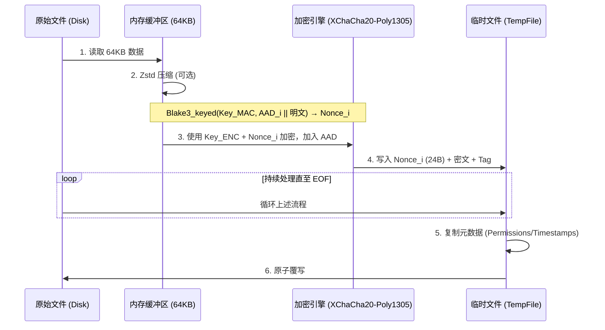

# git-simple-encrypt

[English](../README.md) | 简体中文

这是一个安全、高性能、易于使用的 git 加密工具。只需一个密码，即可在任何设备上加密/解密您的 git 仓库内的指定文件。

- 相比 [git-crypt](https://github.com/AGWA/git-crypt)，它不需要管理 GPG 密钥或备份密钥文件。**单密码对称加密**是核心原则。
- 安全性：v2.0.0+ 版本进行了彻底重构，采用 **Argon2 + XChaCha20-Poly1305** 保证安全性，适用于生产环境。
  - 算法可抗位篡改、分块重排、截断攻击。v4.0.0 新增逐块 AAD 链，旧版本文件的密文块无法被拼接进新版本。请注意其准确边界：这防的是**跨版本的局部拼接**，而不是**整文件回滚**——把一个文件整体换成它自己此前某个合法密文，在不借助文件之外的状态时无法检测，而这个状态正是 git 历史的职责。详见[原理](#原理)。
- 对偶性保证：解密时缓存 salt + FILE_ID，并在加密时复用，若**文件无变更则加密产物也相同**，避免反复加解密导致仓库体积膨胀。Nonce 覆盖每个分块的**完整 AEAD 输入**（AAD——头部、链式 tag、chunk 序号、末块标志——加上当前块明文）计算，在保持确定性同时保证——除可忽略的 PRF 碰撞概率外——Nonce 重复只可能对应逐字节相同的输入。
- 流式处理：采用 64KB 分块加密，降低大文件加密的内存占用。
- 并行加速：多线程并行加解密，充分利用 CPU 多核性能。
- 原子写入：加解密先写入临时文件并 fsync，再原子重命名，防止中断时损坏文件；尽力保留原文件的权限与时间戳。仓库级操作更进一步：只有在*全部*文件都成功准备完毕后才开始替换，因此失败不会留下"改了一半"的仓库（见[原子性](#原子性)）。
- 可配置的 Zstd 压缩：默认开启，减少空间占用。
- 显式允许列表语义：加密列表中的文件一定会被加密和检查，`.gitignore`/`.ignore` 规则无法将其隐藏。操作被限制在仓库根目录之内（`..`、符号链接组件、git 内部文件一律拒绝）；准确的保证范围见[威胁模型](#威胁模型)。
- 零密码持久化：密码不存储在任何地方——每次加解密都交互输入（不回显），或通过 `GIT_SE_PASSWORD` 环境变量提供。基于 `HEAD` 中已提交密文的一致性检查可防止意外改密。
- 支持 git worktree 与 submodule：hook 安装到公共 git 目录，每个 worktree 拥有独立的 salt 缓存。

## 安装

您可以选择以下**任意一种**方式：

- 在 [Releases](https://github.com/lxl66566/git-simple-encrypt/releases) 中下载文件并解压，放入任意存在于 `PATH` 环境变量的目录下。
- 使用 [bpm](https://github.com/lxl66566/bpm)：
  ```sh
  bpm i git-simple-encrypt -b git-se -q
  ```
- 使用 [scoop](https://scoop.sh/)：
  ```sh
  scoop bucket add absx https://github.com/absxsfriends/scoop-bucket
  scoop install git-simple-encrypt
  ```
- 使用 [cargo-binstall](https://github.com/cargo-bins/cargo-binstall)：
  ```sh
  cargo binstall git-simple-encrypt
  ```
- 从源码编译：
  ```sh
  cargo install git-simple-encrypt
  ```
- NixOS 用户可以通过[我的 NUR](https://github.com/lxl66566/NUR) 安装。

## 使用

### 快速上手

```sh
git-se add file.txt mydir   # 1. 将文件/文件夹添加到加密列表
git-se e                    # 2. 原地加密列表中的所有文件（提示输入密码）
git add . && git commit     # 3. 提交【加密后】的文件
git-se d                    # 4. 需要明文时，原地解密
```

所有命令都支持 `-r, --repo <PATH>` 参数，用于操作非当前目录的仓库。

### 命令详解

| 命令 | 别名 | 说明 |
|---|---|---|
| `git-se add <PATHS>...` | | 将文件/目录添加到加密列表 |
| `git-se encrypt [PATHS]... [--allow-password-change]` | `e` | 原地加密：不加参数时处理整个列表，否则只处理指定路径 |
| `git-se decrypt [PATHS]...` | `d` | 原地解密：不加参数时处理整个列表，否则只处理指定路径 |
| `git-se pwd` | `p` | 修改主密码（先全部解密，再用新密码全部加密） |
| `git-se check [PATHS]... [--staged]` | `c` | 若存在未加密的目标文件，以非零状态码退出 |
| `git-se install` | `i` | 安装 pre-commit hook（执行 `check --staged`） |
| `git-se set <FIELD>` | | 修改配置：`zstd-level`、`enable-zstd` |

- **`git-se e` / `git-se d`** —— **原地**加解密，每次都提示输入密码（密码绝不落盘，见[密码处理](#密码处理)）。加密时，已加密的文件会被跳过——但会先用你提供的密码将其**完整解密**（解密到空设备）验证每一个分块，因此用**其他密码**加密的文件、伪造的头部、或被追加明文的密文都会被报告而非略过。解密时，没有合法头部的文件会被跳过。写入是原子的（临时文件 + fsync + 重命名），并尽力保留权限与时间戳。
- **`git-se p`** —— 修改主密码（新密码输入两次）。这是唯一受支持的改密方式，且作为**单个事务**执行：每个文件先在临时文件中完成「旧密码 → 新密码」的重加密，全部成功后才统一替换；替换阶段出错会把已替换的文件回滚。列表中当前为**明文**的文件会用新密码加密，而不是跳过，因此命令不会在残留明文的情况下报告成功；当列表**全部是**明文时，不会询问旧密码（没有可解密的内容），命令直接在这些文件上建立新密码。已加密文件的明文只存在于临时文件中，不会写到目标路径——但请注意[原子性](#原子性)中的崩溃说明。
- **`git-se add <PATHS>...`** —— 将条目加入 `git_simple_encrypt.toml` 的 `crypt_list`。目录会递归处理，其中所有文件都会被加密。路径相对于仓库根目录解析。逃逸仓库的路径（`../...`）、`.git` 内部内容以及配置文件自身会被**拒绝**；重复条目会被忽略。如需*移除*条目，请手动编辑 `git_simple_encrypt.toml`。（手动写入的条目同样必须是纯仓库相对路径——含 `..` 或绝对路径的条目在任何模式下都是硬错误，绝不会被静默忽略。）
- **`git-se c`** —— 检查加密状态，发现未加密文件时以非零状态码退出，可用于 CI。加 `--staged` 时完全基于 index 工作：检查策略覆盖的每一个 index 条目，而不只是有改动的文件，因此扩大加密列表不会漏掉早已提交的明文。策略是**已暂存配置与工作区配置的并集**：`crypt_list` 是允许列表，并集只会要求*更多*加密（fail-closed 方向），也能在「文件已暂存、新增的配置条目尚未暂存」时依然覆盖该文件。无需密码，因此只能校验格式而非真实性（见[威胁模型](#威胁模型)）。含非 ASCII 字节、空格或换行的文件名均可正确处理。
- **`git-se i`** —— 将 `pre-commit` hook 写入 git 实际解析 hook 的目录（`git rev-parse --git-path hooks`：默认是*公共* git 目录，因此对所有 linked worktree 生效；若设置了 `core.hooksPath` 则遵从其指向），提交前运行 `git-se check --staged`；若列表中的文件将以明文提交则阻止提交。hook 已存在时会失败。
- **`git-se set`** —— 非交互式配置：
  - `git-se set zstd-level <1-22>` —— 压缩级别（默认：15）
  - `git-se set enable-zstd <true|false>` —— 开关压缩（默认：true）

### 究竟哪些文件会被加密

加密列表是一个**显式允许列表**：

- `.gitignore`、`.ignore` 与全局 git 排除规则**永远不会**隐藏列表中的文件——只要列入，就会被加密和检查。（这是有意设计：静默跳过列表文件可能诱使您提交明文。）
- 隐藏文件会被包含；符号链接不会被跟随。
- 任何 `.git` 目录（包括嵌套仓库的）以及 `git_simple_encrypt.toml` 配置文件自身永远被排除。
- 所有操作都被限制在仓库根目录之内：`..`、符号链接组件、解析后位于根目录之外的路径一律拒绝；配置文件本身也同样校验——符号链接形式的配置、或解析后位于 git 目录内的配置，会被直接拒绝。唯一不覆盖的情形见[威胁模型](#威胁模型)。

配置文件示例：

```toml
use_zstd = true
zstd_level = 15
crypt_list = ["secrets/", "config.prod.json"]
```

### 密码处理

- **绝不落盘。** 密码只在单次命令执行期间存在于内存中（以 `Zeroizing` 包裹）。每次 `git-se e` / `git-se d` 都会提示输入（不回显）。脚本可使用 `GIT_SE_PASSWORD` 环境变量，或通过管道喂入（`echo "$PW" | git-se e`）。注意环境变量方案**弱于**交互输入：它对进程环境可见（如同一用户可读 `/proc/<pid>/environ`）——git-se 会在派生的每个 git 子进程中擦除它，但无法擦除你的 shell。条件允许时优先交互输入。
- **防打错。** 在*确立*密码时（首次加密，没有可验证的锚点），若密码是在交互终端中输入的，则需输入两次确认；来自 `GIT_SE_PASSWORD` 环境变量或非终端管道输入时跳过确认（没有可确认的对象）。此后 `git-se e` 会用 `HEAD` 中已提交的加密文件验证输入的密码——这正是 `git diff` 的比较基准，因此它跨机器自动保持同步，且无需任何额外存储。
- **意外改密会被拦截。** 若输入的密码与已提交加密文件所用的不一致，可选择重新输入 / 仍用新密码 / 放弃。非交互环境（管道/CI）下直接报错；确属有意改密时加 `--allow-password-change`。当 `HEAD` 中没有可验证的内容时静默跳过检查（此时也没有历史会被扰乱）。`--allow-password-change` 只豁免*密码*锚点检查——绝不放宽仓库边界校验，也不放宽对已加密目标文件的逐文件认证；git-se 在没有可用 `git` 二进制时会拒绝运行（边界校验依赖 git plumbing 的回答）。该标志生效时，**整个加密列表中的每个已加密文件都必须能用给定密码完整认证**，因此它不可能把仓库置于 `git-se p` 无法修复的混合密码状态——若仍有文件回答旧密码，命令会拒绝并提示改用 `git-se p`。
- **解密密码错误**会在首块预检阶段立刻报错，任何文件都不会被写入。
- **修改密码：** `git-se p` 在一个事务内重加密列表中的所有文件，因此仓库不会出现部分文件用旧密码、部分文件用新密码的状态。准确的保证范围见[原子性](#原子性)。
- **迁移：** 旧版本保存在 `.git/config` 中的密码，会在新版 `git-se` 首次打开仓库时自动删除（并给出提示）。

### git worktree 与 submodule

两者均受支持。pre-commit hook 安装到*公共* git 目录，因此对所有 linked worktree 生效；salt 缓存存放在*每个 worktree 各自*的 git 目录（`git rev-parse --absolute-git-dir`），保证各 worktree 的确定性重加密互不影响。

### 原子性

`git-se e`、`git-se d`、`git-se p` 分两个阶段执行：

1. **准备阶段** —— 每个文件都在目标旁边生成临时文件并 fsync，此时磁盘上的可见内容没有任何改变。
2. **提交阶段** —— 先备份每个目标文件，再把临时文件重命名覆盖它。

只要准备阶段有*任一*文件失败，整条命令中止，**不会改动任何一个文件**，临时文件全部丢弃。若提交阶段某个文件失败，所有已替换的文件都会从备份**回滚**，仓库同样回到未改动的状态。这就排除了「仓库改到一半」的状态——例如某个文件仍是密文、下一个却已被写回明文，或者改密后一半文件用旧密码、一半用新密码。

提交阶段开始前，计划中的替换会先记入 git 目录内的事务日志（路径以工作区相对形式记录，因此仓库整体移动后仍可恢复）。若进程在提交途中被杀死，下一条 `git-se` 命令会依据该日志把原文件恢复回来，并提示你重新执行。日志就是提交点：它在全部替换成功后才被删除，且先于备份删除——因此只要日志存在，它引用的每个备份必定也还存在。部分恢复成功后，日志会被重写为仅含尚未恢复的条目；若有内容*无法*自动恢复——或者日志本身已损坏无法解析——**所有** `git-se` 命令都会拒绝运行，直到你按日志所列手动恢复备份并删除该日志：任何命令都不会在一个恢复了一半的仓库上继续执行。

同一仓库同一时间只允许一个 `git-se` 进程操作：进程在整条命令期间持有咨询锁（`<git-dir>/git-se.lock`），第二个 `git-se` 会快速失败，而不是把第一个仍在运行的事务当成崩溃现场去「恢复」、或在提交途中删掉它的文件。命令一结束锁即释放（作为库使用时：最后一个 `Repo` 句柄 drop 时释放）。

需要知悉的限制：

- 准备阶段需要与目标文件总大小相当的临时空间；提交阶段还需短暂容纳每个文件的备份（文件系统支持时用硬链接，否则原子复制）。
- 回滚是尽力而为：如果恢复备份本身也失败（目录变为只读、磁盘写满等），错误信息会列出涉及的每个文件及其备份路径，备份以 `.git-se-bak.*` 形式保留在原地——日志同样保留，因此后续命令不会悄悄丢弃这些恢复材料。
- **在 Unix 上，备份、日志以及每个被替换的目标都在事务关键路径上 fsync，同步失败即中止事务。** 恢复时用备份**复制**覆盖目标（原子方式）而不消耗备份，因此恢复中途崩溃只会在下次运行时重做幂等的工作。这使上述崩溃保证在断电后依然成立。macOS 上目录同步使用 `fcntl(F_FULLFSYNC)`（普通 `fsync` 不会刷磁盘缓存），断电保证同样成立。Windows 没有可移植的目录 fsync：保证降级为*进程崩溃*（SIGKILL、panic）可恢复，不承诺断电持久性。
- **崩溃可能遗留明文临时文件。** `SIGKILL`、断电、OOM 都不会执行析构函数，而被中断的**解密**操作，其临时文件中就是明文。这些文件命名为 `.git-se-tmp.` + 16 位随机字符，会被写入 `<git-dir>/info/exclude` 以确保 `git add` 不会收进它们（该文件的读写失败会明确告警，绝不静默），并在文件超过一小时后被清扫。但从崩溃到清扫之间，明文确实留在磁盘上。这一点无法彻底避免；如果你在意，请把被中断的解密视为该文件的一次泄露。
- **加密的备份同样是明文；改密时原本为明文的成员，其备份也是明文。** 提交阶段在替换前会备份每个目标文件——而加密操作（或 `git-se p` 列表中原本为明文的成员）的目标正是明文。备份在提交完成后立即删除；只有在该窗口内崩溃（或删除失败——此时命令会报错并列出所有受影响路径，而非静默成功）才可能留下备份。与临时文件一样，备份命名可辨识、被 git 排除，并在足够老时被清扫。
- **备份的元数据有边界。** 在不支持硬链接的文件系统上，备份是副本，*尽力*保留权限与时间戳——元数据复制失败只记录日志而不中止，因此不作保证。所有权、ACL、xattr 等平台特有属性一律不复制。此类副本上的回滚恢复内容，并尽力恢复权限与时间戳。
- **清扫依据的名称形状是保留名称，并非归属证明。** 清扫会删除名为 `.git-se-tmp.` + 恰好 16 位字母数字、或 `.git-se-bak.<32 位十六进制>.<数字>` 且存在超过一小时的文件。如果你的文件恰好使用完全相同的名称，它与 git-se 的遗留文件无从区分，**会被一并删除**——请把这些名称形状视为保留名，不要用于自己的文件。git-se 从未生成过的形状（如 `.git-se-tmp.ABC123`、`.git-se-bak.2024`、`.git-se-bak.data`）一律不匹配，永远保留。

### 威胁模型

git-se 保护的是加密列表中文件的**内容**，防范能读到仓库的一方——git 托管方、备份、被盗的笔记本。在此范围内：

- **仓库边界的保证**成立的前提是：没有其他进程正在并发改动仓库的目录结构。路径会经过校验（无 `..`、无符号链接组件、canonical 形式位于根目录内）并在使用前复验，但校验与随后的 `open`/`rename` 终究是分开的系统调用。对仓库**内部**某个目录有写权限的本地攻击者，原则上可以赢得这个竞态，把读写重定向到仓库之外。彻底堵死需要 capability-based API（`openat2` 的 `RESOLVE_BENEATH`），而它只有 Linux 才有；git-se 同时支持 macOS 与 Windows，因此未采用。**请不要在目录可被你不信任的用户写入的仓库上运行 git-se。**
- **`git-se c` 是防意外的护栏，不是认证。** 它无需密码，因此只能检查文件*看起来*是否已加密：魔数、版本、flags 以及分块 framing 是否合理。刻意构造的文件——例如合法头部后面接明文——是可以通过的。它能可靠地拦住它存在的意义：忘记执行 `git-se e`。更强的保证需要密码，而 `git-se e` 确实用了（见下条）。
- **`git-se e` 会先认证再跳过。** 已加密的文件会用你提供的密码**完整解密**（解密到空设备）验证每一个分块，而非只验首块，因此用**其他密码**加密的文件、伪造的头部、或被追加明文的密文，都会被报告出来，而不是被静默略过。
- **HEAD 密码验证设有 Argon2 预算。** 针对已提交锚点验证密码时，每个*不同 salt* 的锚点都要付出一次 Argon2 派生的代价，而恶意仓库可以提交大量小型伪造锚点（无需知道密码）来放大这一开销。因此验证在 8 个不同 salt 后停止，并以**无法判定**失败（既不接受也不拒绝密码），而不是无限消耗 CPU。正常仓库远达不到此限：锚点共享加密当次的批次 salt（不同 salt 数 ≈ 加密批次数），且正确密码在第一个真锚点处即匹配成功。确有超过默认值的历史，可通过 `GIT_SE_HEAD_ANCHOR_BUDGET` 显式提高预算。需要注意，预算只是为攻击**封顶**而非消除：恶意仓库仍可在每次 `git-se e` 时制造至多该次数的派生——数秒的固定延迟——随后验证以无法判定失败。如果你经常在不可信克隆上工作，这是「验证」本身的代价；替代项（`--allow-password-change`）会完全跳过验证。
- **工作区操作同样设有 Argon2 预算。** 同样的伪造文件手法对加解密目标也成立：恶意克隆可以携带任意数量的小型伪造加密文件，其中每个*不同 salt* 在被拒绝前都要付出一次派生的代价。因此操作会先扫描目标文件头部，当目标中的不同 salt 超过 64 个时——在任何针对目标的派生发生之前——直接拒绝；确有如此多加密批次的仓库，可通过 `GIT_SE_SALT_BUDGET` 显式提高预算。与总量无关，并发执行的 Argon2 数量也有限制（至多 4 个），以约束多核机器上的瞬时内存峰值。（取自本地 salt 缓存的 salt 不计入：缓存位于 git 目录内，克隆的仓库无法携带它。）
- **真实的 git 目录无论叫什么名字都不可触碰。** `git init --separate-git-dir=<dir>` 可以把真实 git 目录放在工作区内的任意名称之下。git-se 通过 git plumbing 解析 git 目录，并将其与 `.git` 同等对待：`add` 与显式目标指向其中一律拒绝，递归遍历剪枝，staged 检查永不要求其加密，事务恢复拒绝还原到其中，临时文件清扫也绝不进入。**嵌套仓库**同样适用：打开仓库时 git-se 会扫描工作区内的嵌套 git 目录——`.git` 目录、`.git` 指针文件（`gitdir: ...`，限长读取；目标先 canonicalize 并确认位于工作区内，之后才读取其任何内容，且仅当目标确实是 git 目录时才生效，伪造的 pointer 无法隐藏任何内容），以及嵌套 **bare 仓库**（按严格的 `HEAD` + `objects/` + `refs/` 结构**加上 `config` 中 `[core]` `bare`/`worktree` 证据**识别——每个 git 创建的 git 目录都带有该证据；两个文件均限长读取）。**形状本身绝不作为判定**：git 会把 `HEAD`/`objects/`/`refs/` 形状的内容当普通文件正常跟踪，因此缺少 config 证据的候选目录、或其下存在被本仓库跟踪的文件的候选目录，都会使打开以歧义错误失败，并提示如何消除歧义——静默保护此类目录可能把已跟踪的明文挡在加密列表（以及 `check --staged`）之外，静默加密又可能 shred 一个仓库。确认后的发现加入统一受保护集合，供 `add`、显式目标、遍历、staged 检查、HEAD 锚点、事务恢复与清扫共享；嵌套工作区的普通文件仍在处理范围内。该扫描是 fail-closed 的，且每次打开都覆盖整个工作区——嵌套 git 目录可能位于任何位置，不可读目录无法被安全跳过（其中的文件仍可能按路径被替换），因此不可读的 pointer、目录或 `HEAD` 会阻塞所有命令，直到原因被修复。
- **无法阻止整文件密文回滚。** 见前文关于重放的说明，防线是 git 历史本身。
- **密码的安全性不超过进程本身。** 见[密码处理](#密码处理)；尤其是 `GIT_SE_PASSWORD` 环境变量，任何能读取进程环境的东西都能看到它。

## 注意事项

- 配置文件：加密列表与配置存储在 `git_simple_encrypt.toml` 中，如需从列表中删除文件，请手动编辑该文件。
- 迁移须知：
  - 所有的 major version 之间加解密算法都不兼容。请先解密仓库的所有文件，对于 v1.x -> v2.x 还需要去除 `git_simple_encrypt.toml` 列表里的所有 wildcard 格式（v2.x+ 不支持 wildcard），然后再升级版本。
  - **v3.x -> v4.x**：请先用 v3 解密所有文件（`git-se d`），再升级。v4.x 只能读取格式版本 5 的文件（逐块 AAD 链 + nonce 覆盖完整 AEAD 输入）。v4.x 同时不再持久化任何密码相关内容：旧版本保存在 `.git/config` 中的密码会在首次运行时自动删除。
  - **发布前的 v4 开发构建**：它们写入的是格式版本 4（仅按明文派生 nonce），该格式被有意拒绝读取——它从未正式发布。如果你使用过此类开发构建，请先用它解密，再用发布版本重新加密。

---

## 原理

v4.0.0+ 版本的加密流程如下：

### 1\. 密钥派生

- 程序通过 Argon2 算法结合文件的 16B Salt 派生出 32B 的 Master Key，再通过 `blake3::derive_key` 拆分为两个独立密钥，用于 XChaCha20-Poly1305 加密 + 计算每个分块的 Nonce。
  - 利用 `DashMap<Salt, Arc<OnceLock>>` 缓存已派生的密钥，减少重复 Argon2 运算。

### 2\. 头部结构

每个加密文件都包含一个标准头部（64 字节）：

```text
 00          04  05  06  07           17                  27              3F
 +-----------+---+---+---+-----------+-------------------+---------------+
 |   MAGIC   | V | F | A |   SALT    |      FILE_ID      |   RESERVED    |
 |  "GITSE"  |   |   |   | (16 bytes)|    (16 bytes)     |  (24 bytes)   |
 +-----------+---+---+---+-----------+-------------------+---------------+
      |        |   |   |
      |        |   |   +--- 加密算法 (1 = XChaCha20-Poly1305)
      |        |   +------- 压缩标志位 (Bit 0: 是否 Zstd 压缩)
      |        +----------- 版本号 (当前为 5)
      +-------------------- 魔数
```

- FILE_ID：每次加密新文件时随机生成的 16 字节标识符，用于 Nonce 派生。

### 3\. 加密逻辑

- 算法： 文件被切分为 64KB 的块，使用 XChaCha20-Poly1305 进行加密。
- Nonce 派生： 每个 chunk 的 nonce 覆盖该块的**完整 AEAD 输入**（组装完毕的 AAD + 当前块明文），通过带密钥的 Blake3 哈希计算：`Nonce_i = Blake3_keyed(Key_MAC, AAD_i || M_i)[0..24]`。因此除可忽略的 PRF 碰撞概率外（nonce 是 256 位带密钥 Blake3 输出截断为 192 位），nonce 重复 ⟺ (AAD, 明文) 完全重复（逐字节一致的重加密，无害）。（此前仅由明文派生：编辑前序块会改变未变尾块的 AAD 而其 nonce 不变，导致同一 Poly1305 一次性密钥认证两个不同输入。）
- AAD（v4 链）： 每个 chunk 的 AAD 为完整的 64B HEADER + **前一块的 Poly1305 tag**（16B；第 0 块以 FILE_ID 作为链种子）+ chunk_idx (8B) + is_last_chunk (1B)，共 89B。将每个块绑定到前驱块的 tag 意味着：从同文件旧版本重放的密文块会在下一块处认证失败——任何拼接都会坍缩为整文件回退，而回退到曾经合法的密文并非伪造。
- 存储格式： 每个加密分块的物理结构为 `[NONCE (24B)] [CIPHERTEXT (<= 64KB)] [Poly1305 TAG (16B)]`，Nonce 存储在分块头部。



解密：从文件读取 24 字节作为 `Nonce_i`，读取后续的密文 + Tag，调用 XChaCha20-Poly1305 解密。随后每个分块都会按 v5 派生约定验证：在已认证明文上重算 `Blake3_keyed(Key_MAC, AAD_i || M_i)[0..24]`，与保存的 nonce 不一致即拒绝——非合规生产者（如发布前的 v4 开发格式）的密文即使通过认证也会被拒绝。

### 4. 确定性重加密（Salt + File_ID 缓存）

为保证 decrypt -> encrypt 循环对相同文件产生完全相同的密文，程序将每个文件的 Salt 和 File_ID 持久化在每个 worktree 各自 git 目录（`git rev-parse --absolute-git-dir`，普通仓库即 `.git/`）下的 `git-simple-encrypt-salt-cache` 中，因此 linked worktree 与 submodule 各自拥有独立的缓存。

- 加密（只读缓存）：通过 rkyv 安全 API 将缓存文件反序列化为自有映射（无 mmap、无 unsafe）。
- 解密（写入缓存）：Rayon 线程通过 mpsc channel 发送 `(path, salt, file_id)`，主线程收集后通过 rkyv 序列化，并原子写入到磁盘，与已有缓存合并。
  - 缓存 key 使用仓库相对路径的原始字节（`/` 作为分隔符），确保跨平台一致性。
  - 只有在解密完全成功后才会写入缓存条目，失败的尝试（密码错误、数据损坏）不会污染缓存。
  - 缓存文件的所有读写都由 `fd-lock` 咨询锁保护，并发运行的 git-se 进程不会丢失彼此的条目。该锁是 fail-closed 的：拿不到锁的操作会报错，而不是静默放弃这一保证。
