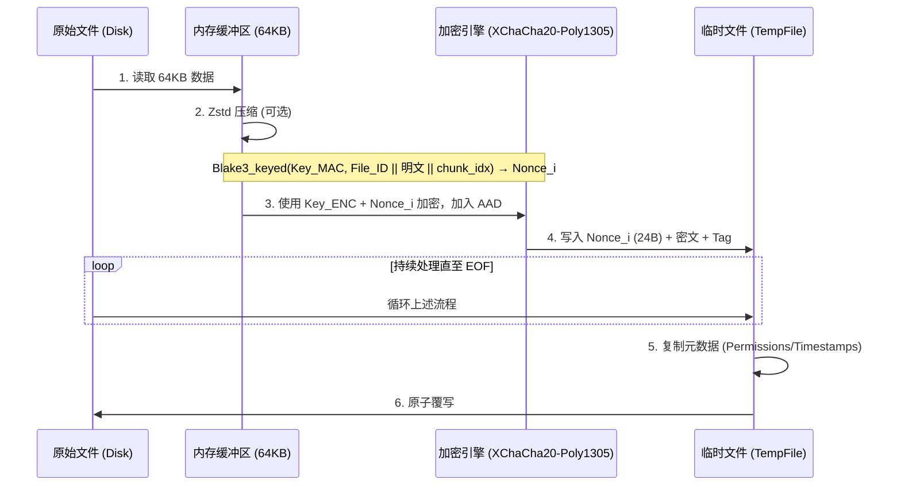

# git-simple-encrypt

[English](../README.md) | 简体中文

这是一个安全、高性能、易于使用的 git 加密工具。只需一个密码，即可在任何设备上加密/解密您的 git 仓库内的指定文件。

- 相比 [git-crypt](https://github.com/AGWA/git-crypt)，它不需要管理 GPG 密钥或备份密钥文件。**单密码对称加密**是核心原则。
- 安全性：v2.0.0+ 版本进行了彻底重构，采用 **Argon2 + XChaCha20-Poly1305** 保证安全性，适用于生产环境。
  - 算法可抗位篡改、分块重排、截断攻击。v4.0.0 新增逐块 AAD 链，旧版本文件的密文块无法被拼接进新版本。请注意其准确边界：这防的是**跨版本的局部拼接**，而不是**整文件回滚**——把一个文件整体换成它自己此前某个合法密文，在不借助文件之外的状态时无法检测，而这个状态正是 git 历史的职责。详见[原理](#原理)。
- 对偶性保证：解密时缓存 salt + FILE_ID，并在加密时复用，若**文件无变更则加密产物也相同**，避免反复加解密导致仓库体积膨胀。v3.0.0+ Nonce 基于当前分块明文 + File_ID + chunk_idx 计算，在保持确定性同时消除了 Nonce 重用风险和跨文件数据块碰撞问题。
- 流式处理：采用 64KB 分块加密，降低大文件加密的内存占用。
- 并行加速：多线程并行加解密，充分利用 CPU 多核性能。
- 原子写入：加解密先写入临时文件并 fsync，再原子重命名，防止中断时损坏文件；保留原文件的权限与时间戳。仓库级操作更进一步：只有在*全部*文件都成功准备完毕后才开始替换，因此失败不会留下"改了一半"的仓库（见[原子性](#原子性)）。
- 可配置的 Zstd 压缩：默认开启，减少空间占用。
- 显式允许列表语义：加密列表中的文件一定会被加密和检查，`.gitignore`/`.ignore` 规则无法将其隐藏。所有操作都严格限制在仓库根目录之内。
- 零密码持久化：密码不存储在任何地方——每次加解密都交互输入（不回显），或通过 `GIT_SE_PASSWORD` 环境变量提供。基于 `HEAD` 中已提交密文的一致性检查可防止意外改密。
- 支持 git worktree 与 submodule：hook 安装到公共 git 目录，每个 worktree 拥有独立的 salt 缓存。

## 安装

您可以选择以下**任意一种**方式：

- 在 [Releases](https://github.com/lxl66566/git-simple-encrypt/releases) 中下载文件并解压，放入任意存在于 `PATH` 环境变量的目录下。
- 使用 [bpm](https://github.com/lxl66566/bpm)：
  ```sh
  bpm i git-simple-encrypt -b git-se -q
  ```
- 使用 [scoop](https://scoop.sh/)：
  ```sh
  scoop bucket add absx https://github.com/absxsfriends/scoop-bucket
  scoop install git-simple-encrypt
  ```
- 使用 [cargo-binstall](https://github.com/cargo-bins/cargo-binstall)：
  ```sh
  cargo binstall git-simple-encrypt
  ```
- 从源码编译：
  ```sh
  cargo install git-simple-encrypt
  ```
- NixOS 用户可以通过[我的 NUR](https://github.com/lxl66566/NUR) 安装。

## 使用

### 快速上手

```sh
git-se add file.txt mydir   # 1. 将文件/文件夹添加到加密列表
git-se e                    # 2. 原地加密列表中的所有文件（提示输入密码）
git add . && git commit     # 3. 提交【加密后】的文件
git-se d                    # 4. 需要明文时，原地解密
```

所有命令都支持 `-r, --repo <PATH>` 参数，用于操作非当前目录的仓库。

### 命令详解

| 命令 | 别名 | 说明 |
|---|---|---|
| `git-se add <PATHS>...` | | 将文件/目录添加到加密列表 |
| `git-se encrypt [PATHS]... [--allow-password-change]` | `e` | 原地加密：不加参数时处理整个列表，否则只处理指定路径 |
| `git-se decrypt [PATHS]...` | `d` | 原地解密：不加参数时处理整个列表，否则只处理指定路径 |
| `git-se pwd` | `p` | 修改主密码（先全部解密，再用新密码全部加密） |
| `git-se check [PATHS]... [--staged]` | `c` | 若存在未加密的目标文件，以非零状态码退出 |
| `git-se install` | `i` | 安装 pre-commit hook（执行 `check --staged`） |
| `git-se set <FIELD>` | | 修改配置：`zstd-level`、`enable-zstd` |

- **`git-se e` / `git-se d`** —— **原地**加解密，每次都提示输入密码（密码绝不落盘，见[密码处理](#密码处理)）。已加密的文件在加密时跳过；没有合法头部的文件在解密时跳过。写入是原子的（临时文件 + fsync + 重命名），并保留权限与时间戳。
- **`git-se p`** —— 修改主密码（新密码输入两次）。这是唯一受支持的改密方式，且作为**单个事务**执行：每个文件先在临时文件中完成"旧密码 → 新密码"的重加密，全部成功后才统一替换原文件。任一环节失败则不改动任何文件，所有内容仍可用旧密码读取；明文全程不会落到工作区。
- **`git-se add <PATHS>...`** —— 将条目加入 `git_simple_encrypt.toml` 的 `crypt_list`。目录会递归处理，其中所有文件都会被加密。路径相对于仓库根目录解析。逃逸仓库的路径（`../...`）、`.git` 内部内容以及配置文件自身会被**拒绝**；重复条目会被忽略。如需*移除*条目，请手动编辑 `git_simple_encrypt.toml`。
- **`git-se c`** —— 检查加密状态，发现未加密文件时以非零状态码退出，可用于 CI。加 `--staged` 时只检查本次暂存的文件（pre-commit hook 即调用此模式），非 ASCII 及特殊文件名均可正确处理。无需密码。
- **`git-se i`** —— 将 `pre-commit` hook 写入*公共* git 目录（因此对所有 linked worktree 生效），提交前运行 `git-se check --staged`；若列表中的文件将以明文提交则阻止提交。hook 已存在时会失败。
- **`git-se set`** —— 非交互式配置：
  - `git-se set zstd-level <1-22>` —— 压缩级别（默认：15）
  - `git-se set enable-zstd <true|false>` —— 开关压缩（默认：true）

### 究竟哪些文件会被加密

加密列表是一个**显式允许列表**：

- `.gitignore`、`.ignore` 与全局 git 排除规则**永远不会**隐藏列表中的文件——只要列入，就会被加密和检查。（这是有意设计：静默跳过列表文件可能诱使您提交明文。）
- 隐藏文件会被包含；符号链接不会被跟随。
- `.git` 与 `git_simple_encrypt.toml` 配置文件自身永远被排除。
- 所有操作都被限制在仓库根目录之内——绝不读写仓库外的文件。

配置文件示例：

```toml
use_zstd = true
zstd_level = 15
crypt_list = ["secrets/", "config.prod.json"]
```

### 密码处理

- **绝不落盘。** 密码只在单次命令执行期间存在于内存中（以 `Zeroizing` 包裹）。每次 `git-se e` / `git-se d` 都会提示输入（不回显）。脚本可使用 `GIT_SE_PASSWORD` 环境变量，或通过管道喂入（`echo "$PW" | git-se e`）。注意环境变量方案**弱于**交互输入：它对进程环境可见（如同一用户可读 `/proc/<pid>/environ`）——git-se 会在派生的每个 git 子进程中擦除它，但无法擦除你的 shell。条件允许时优先交互输入。
- **防打错。** 在*确立*密码时（首次加密，没有可验证的锚点），密码需输入两次。此后 `git-se e` 会用 `HEAD` 中已提交的加密文件验证输入的密码——这正是 `git diff` 的比较基准，因此它跨机器自动保持同步，且无需任何额外存储。
- **意外改密会被拦截。** 若输入的密码与已提交加密文件所用的不一致，可选择重新输入 / 仍用新密码 / 放弃。非交互环境（管道/CI）下直接报错；确属有意改密时加 `--allow-password-change`。当 `HEAD` 中没有可验证的内容时静默跳过检查（此时也没有历史会被扰乱）。
- **解密密码错误**会在首块预检阶段立刻报错，任何文件都不会被写入。
- **修改密码：** `git-se p` 在一个事务内重加密列表中的所有文件，因此仓库不会出现部分文件用旧密码、部分文件用新密码的状态。准确的保证范围见[原子性](#原子性)。
- **迁移：** 旧版本保存在 `.git/config` 中的密码，会在新版 `git-se` 首次打开仓库时自动删除（并给出提示）。

### git worktree 与 submodule

两者均受支持。pre-commit hook 安装到*公共* git 目录，因此对所有 linked worktree 生效；salt 缓存存放在*每个 worktree 各自*的 git 目录（`git rev-parse --absolute-git-dir`），保证各 worktree 的确定性重加密互不影响。

### 原子性

`git-se e`、`git-se d`、`git-se p` 分两个阶段执行：

1. **准备阶段** —— 每个文件都在目标旁边生成临时文件并 fsync，此时磁盘上的可见内容没有任何改变。
2. **提交阶段** —— 把这些临时文件重命名覆盖原文件。

只要准备阶段有*任一*文件失败，整条命令中止，**不会改动任何一个文件**，临时文件全部丢弃。这就排除了"仓库改到一半"的状态——例如某个文件仍是密文、下一个却已经被写回明文。

两点限制需要知悉：

- 准备阶段需要与目标文件总大小相当的临时空间。
- 提交阶段失败（`rename` 中途出错；由于临时文件已 fsync，这种情况很罕见）仍可能出现部分文件已替换、部分未替换。错误信息会给出已提交的数量；重新执行同一条命令即可收敛，因为两种操作都是幂等的。

## 注意事项

- 配置文件：加密列表与配置存储在 `git_simple_encrypt.toml` 中，如需从列表中删除文件，请手动编辑该文件。
- 迁移须知：
  - 所有的 major version 之间加解密算法都不兼容。请先解密仓库的所有文件，对于 v1.x -> v2.x 还需要去除 `git_simple_encrypt.toml` 列表里的所有 wildcard 格式（v2.x+ 不支持 wildcard），然后再升级版本。
  - **v3.x -> v4.x**：请先用 v3 解密所有文件（`git-se d`），再升级。v4 只能读取 v4 格式（格式版本 4，逐块 AAD 链）。v4 同时不再持久化任何密码相关内容：旧版本保存在 `.git/config` 中的密码会在首次运行时自动删除。

---

## 原理

v4.0.0+ 版本的加密流程如下：

### 1\. 密钥派生

- 程序通过 Argon2 算法结合文件的 16B Salt 派生出 32B 的 Master Key，再通过 `blake3::derive_key` 拆分为两个独立密钥，用于 XChaCha20-Poly1305 加密 + 计算每个分块的 Nonce。
  - 利用 `DashMap<Salt, Arc<OnceLock>>` 缓存已派生的密钥，减少重复 Argon2 运算。

### 2\. 头部结构

每个加密文件都包含一个标准头部（64 字节）：

```text
 00          04  05  06  07           17                  27              3F
 +-----------+---+---+---+-----------+-------------------+---------------+
 |   MAGIC   | V | F | A |   SALT    |      FILE_ID      |   RESERVED    |
 |  "GITSE"  |   |   |   | (16 bytes)|    (16 bytes)     |  (24 bytes)   |
 +-----------+---+---+---+-----------+-------------------+---------------+
      |        |   |   |
      |        |   |   +--- 加密算法 (1 = XChaCha20-Poly1305)
      |        |   +------- 压缩标志位 (Bit 0: 是否 Zstd 压缩)
      |        +----------- 版本号 (当前为 4)
      +-------------------- 魔数
```

- FILE_ID：每次加密新文件时随机生成的 16 字节标识符，用于 Nonce 派生。

### 3\. 加密逻辑

- 算法： 文件被切分为 64KB 的块，使用 XChaCha20-Poly1305 进行加密。
- Nonce 派生： 每个 chunk 的 nonce 基于 File_ID 和当前块自身的明文内容，通过带密钥的 Blake3 哈希计算：`Nonce_i = Blake3_keyed(Key_MAC, File_ID || M_i || chunk_idx)[0..24]`
- AAD（v4 链）： 每个 chunk 的 AAD 为完整的 64B HEADER + **前一块的 Poly1305 tag**（16B；第 0 块以 FILE_ID 作为链种子）+ chunk_idx (8B) + is_last_chunk (1B)，共 89B。将每个块绑定到前驱块的 tag 意味着：从同文件旧版本重放的密文块会在下一块处认证失败——任何拼接都会坍缩为整文件回退，而回退到曾经合法的密文并非伪造。
- 存储格式： 每个加密分块的物理结构为 `[NONCE (24B)] [CIPHERTEXT (<= 64KB)] [Poly1305 TAG (16B)]`，Nonce 存储在分块头部。



解密：从文件读取 24 字节作为 `Nonce_i`，读取后续的密文 + Tag，直接调用 XChaCha20-Poly1305 解密。

### 4. 确定性重加密（Salt + File_ID 缓存）

为保证 decrypt -> encrypt 循环对相同文件产生完全相同的密文，程序将每个文件的 Salt 和 File_ID 持久化在每个 worktree 各自 git 目录（`git rev-parse --absolute-git-dir`，普通仓库即 `.git/`）下的 `git-simple-encrypt-salt-cache` 中，因此 linked worktree 与 submodule 各自拥有独立的缓存。

- 加密（只读缓存）：通过 rkyv 安全 API 将缓存文件反序列化为自有映射（无 mmap、无 unsafe）。
- 解密（写入缓存）：Rayon 线程通过 mpsc channel 发送 `(path, salt, file_id)`，主线程收集后通过 rkyv 序列化，并原子写入到磁盘，与已有缓存合并。
  - 缓存 key 使用仓库相对路径的原始字节（`/` 作为分隔符），确保跨平台一致性。
  - 只有在解密完全成功后才会写入缓存条目，失败的尝试（密码错误、数据损坏）不会污染缓存。
  - 缓存文件的所有读写都由 `fd-lock` 咨询锁保护，并发运行的 git-se 进程不会丢失彼此的条目。
